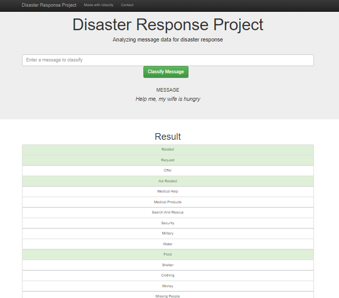
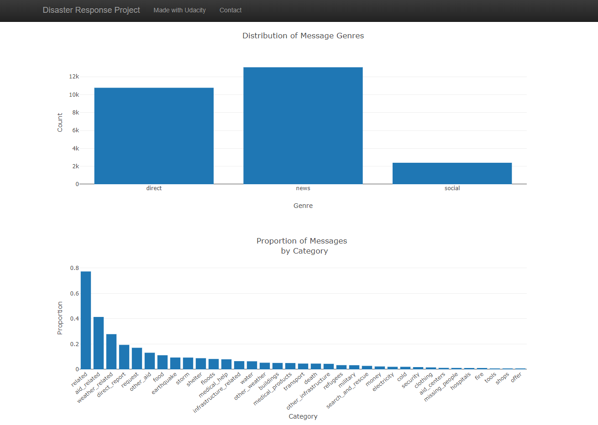

# Disaster Response Pipeline Project

Portfolio project to showcase Data Engineering skills including ETL and ML pipeline preparation, utilising model in a web app, and data visualisation.
## Required packages

- nltk 3.4.5
- numpy 1.17.2
- pandas 0.25.1
- scikit-learn 0.20.3
- sqlalchemy 1.3.10
- flask 1.1.1
- plotly 4.2.1

## Instructions:
1. Run the following commands in the project's root directory to set up your database and model.

    - To run ETL pipeline that cleans data and stores in database
        `python data/process_data.py data/disaster_messages.csv data/disaster_categories.csv data/database_test.db`

    - To run ML pipeline that trains classifier and saves
        `python models/train_classifier.py data/DisasterResponse.db models/model_gridsearch_1_pickle.pkl`

2. Run the following command in the app's directory to run your web app.
    `python run.py`

3. Go to http://127.0.0.1:5000/

Below are a few screenshots of the web app.

## Important Files:
- `data/process_data.py`: The ETL pipeline used to process data in preparation for model building.
            - Loads the messages and categories datasets
            - Merges the two datasets
            - Cleans the data
            - Stores it in a SQLite database
- `models/train_classifier.py`: The Machine Learning pipeline used to fit, tune, evaluate, and export the model to a Python pickle (pickle is not uploaded to the repo due to size constraints.).
            - Loads data from the SQLite database
            - Splits the dataset into training and test sets
            - Builds a text processing and machine learning pipeline
            - Trains and tunes a model using GridSearchCV
            - Outputs results on the test set
            - Exports the final model as a pickle file
- `app/templates/*.html`: HTML templates for the web app.
- `run.py`: Start the Python server for the web app and prepare visualizations.
            - uses flask and plotly for data vizualization via javascript, css and html

